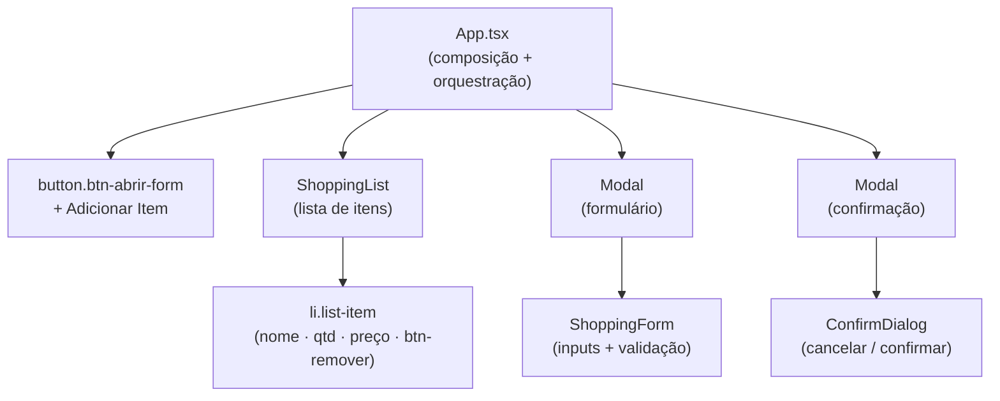
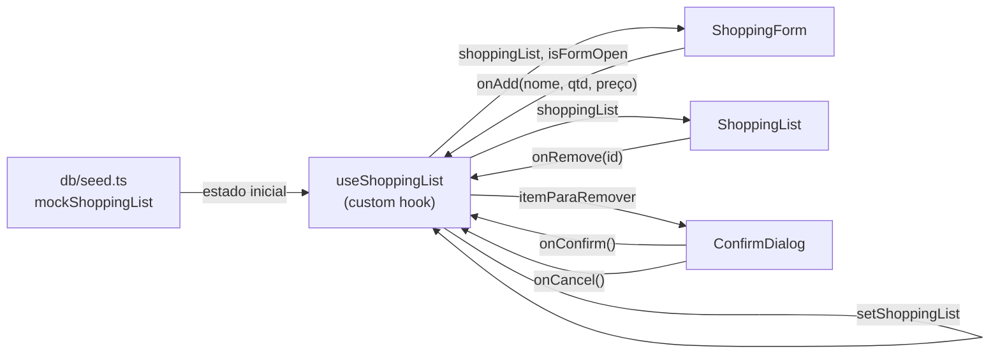
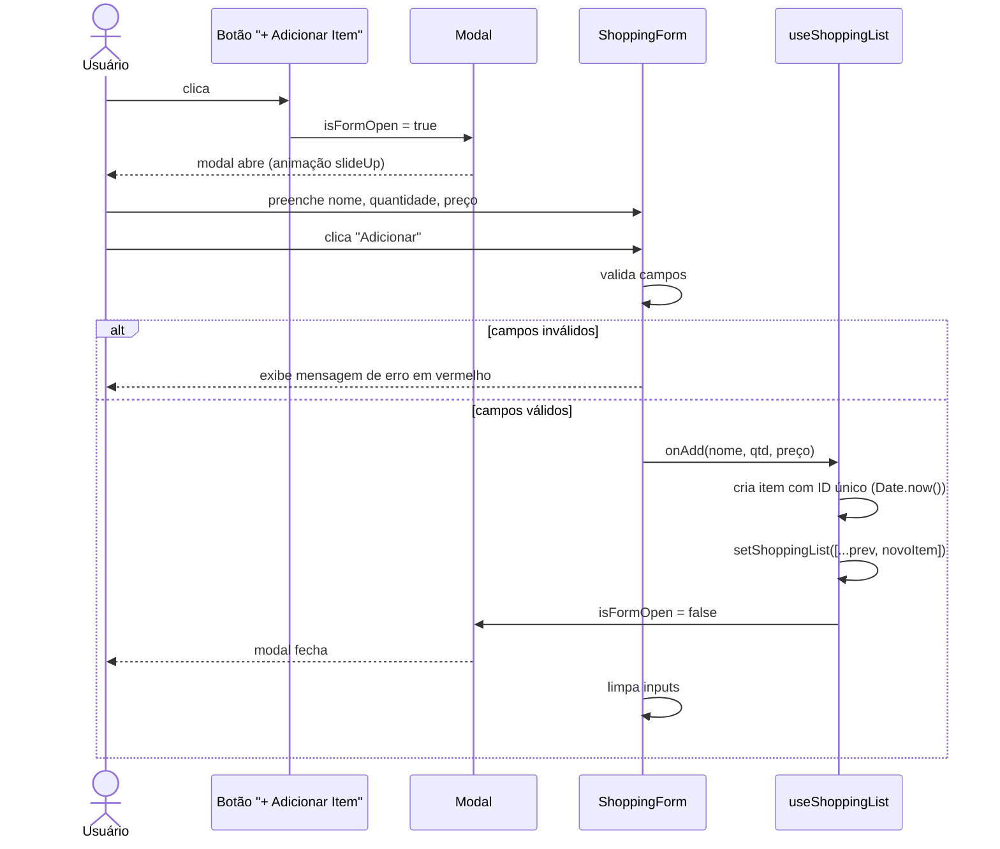
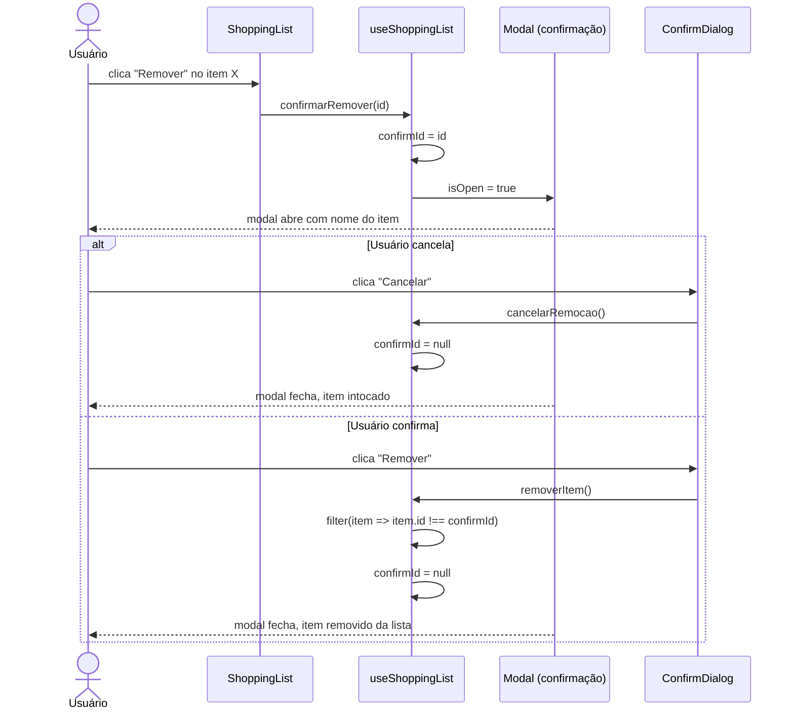
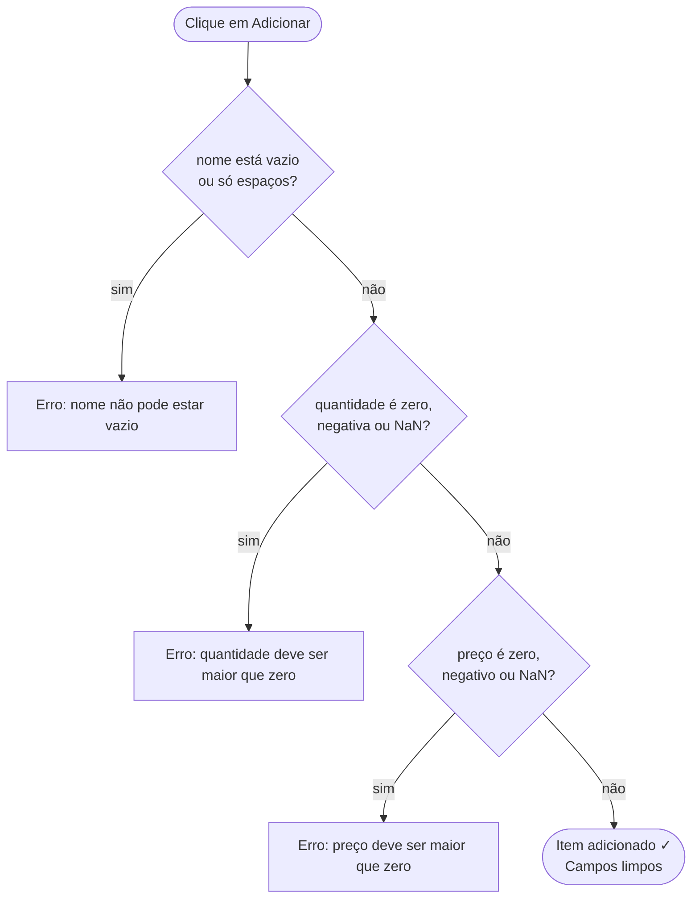

# Mercadinho — Lista de Compras em React

> Projeto de treinamento em React desenvolvido no 3º semestre do curso.  
> O objetivo é praticar os fundamentos da biblioteca: estado, props, eventos, renderização dinâmica e componentização.

---

## Sobre o projeto

O **Mercadinho** é um aplicativo web de lista de compras construído com React + TypeScript + Vite. Ele permite adicionar produtos (nome, quantidade e preço), visualizar a lista com subtotais e total geral, e remover itens com confirmação.

O projeto foi desenvolvido em fases, seguindo um cronograma de aprendizado que avança do visual estático até a lógica completa de estado.

---

## Conceitos de React praticados

| Conceito | Onde foi aplicado |
|---|---|
| `useState` | Estado da lista, inputs do formulário, controle de modais |
| `props` | Comunicação entre `App → ShoppingList → ConfirmDialog` |
| Lifting State Up | Estado da lista centralizado no `useShoppingList` e distribuído via props |
| `useEffect` | Listener de teclado (Esc) no componente `Modal` |
| Custom Hook | `useShoppingList` encapsula toda a lógica de estado |
| Renderização condicional | Lista vazia, mensagem de erro, exibição do modal |
| `.map()` com `key` | Renderização dinâmica dos itens da lista |
| `.filter()` | Remoção de itens sem mutar o estado diretamente |
| Spread operator | `[...prev, novoItem]` para criar nova lista imutável |

---

## Stack

- **React 19** — biblioteca de UI
- **TypeScript 6** — tipagem estática
- **Vite 8** — bundler e servidor de desenvolvimento
- **CSS puro** — estilização em `App.css` com variáveis CSS

---

## Arquitetura de componentes



---

## Fluxo de estado



---

## Fluxo de interação — Adicionar item



---

## Fluxo de interação — Remover item



---

## Validações do formulário



---

## Estrutura de arquivos

```
shopFront/
├── src/
│   ├── App.tsx                  # Composição — conecta todos os componentes
│   ├── App.css                  # Estilos do app (formulário, lista, modais)
│   ├── main.tsx                 # Ponto de entrada React
│   ├── index.css                # Estilos globais e variáveis CSS
│   ├── hooks/
│   │   └── useShoppingList.ts   # Custom hook — estado e operações da lista
│   ├── components/
│   │   ├── Modal.tsx            # Overlay genérico reutilizável
│   │   ├── ConfirmDialog.tsx    # Conteúdo do modal de confirmação
│   │   ├── ShoppingForm.tsx     # Formulário de adição com validação
│   │   └── ShoppingList.tsx     # Lista dinâmica com subtotais e total
│   └── db/
│       └── seed.ts              # Schema ShoppingItem + dados iniciais
├── docs/
│   ├── atividade.md             # Requisitos e critérios de avaliação
│   └── TDD.md                   # Roteiro de testes manuais
├── PROGRESSION.TXT              # Diário de desenvolvimento detalhado
└── README.md                    # Este arquivo
```

---

## Como rodar

```bash
# Instalar dependências
cd shopFront
npm install

# Iniciar servidor de desenvolvimento
npm run dev

# Build de produção
npm run build
```

O app estará disponível em `http://localhost:5173`.

---

## Funcionalidades

- Adicionar produto com nome, quantidade e preço via modal
- Validação de campos com mensagem de erro em tempo real
- Lista dinâmica com preço unitário, subtotal por item e total geral
- Remoção individual com modal de confirmação
- Mensagem "Sua lista está vazia!" quando a lista fica vazia
- Responsivo para dispositivos móveis
- Suporte a tema escuro via variáveis CSS
